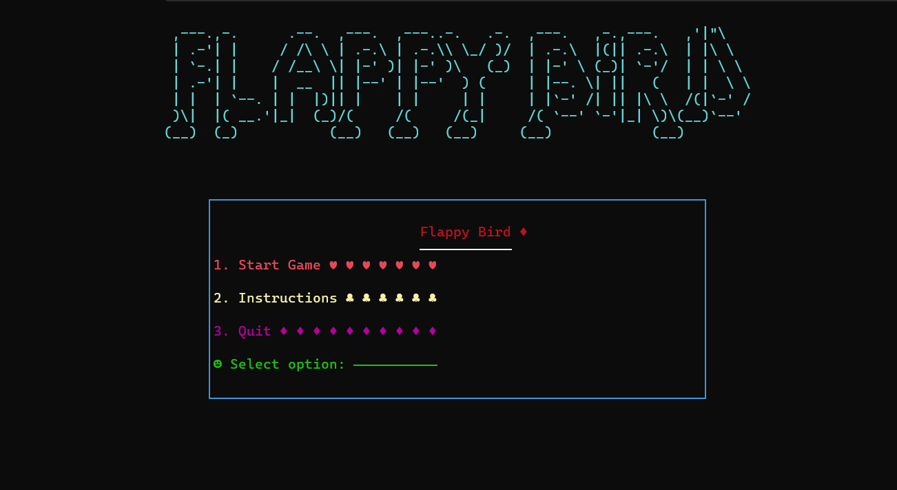
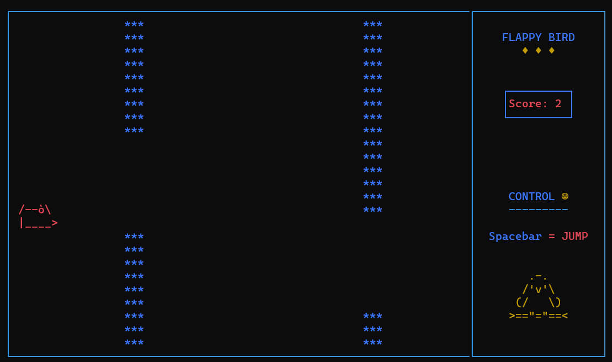
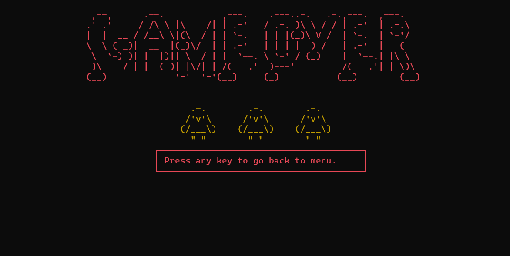
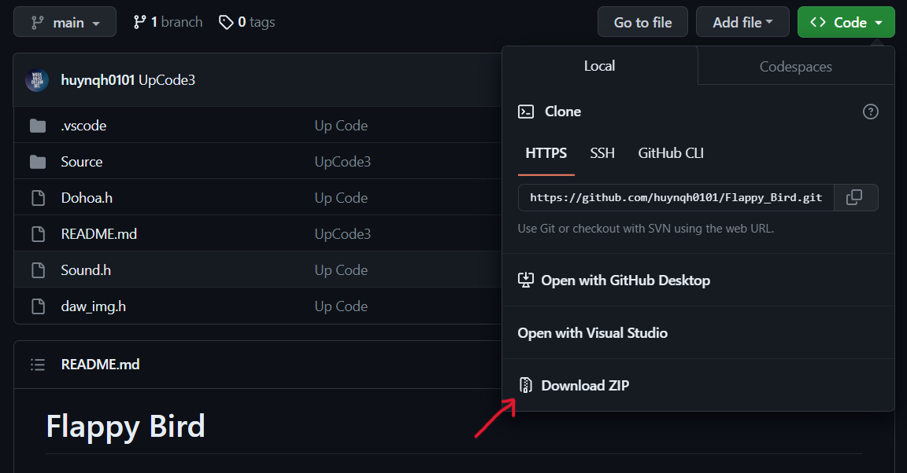
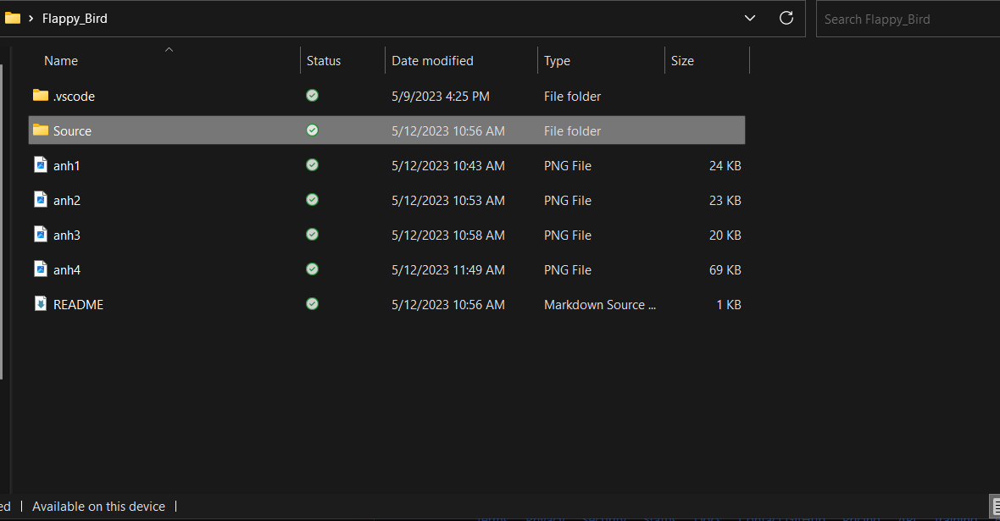
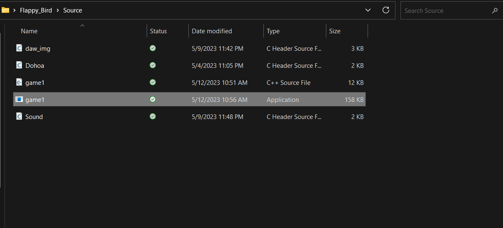

# Flappy Bird
---

##Giới thiệu
---
Game được viết bởi ngôn ngữ `C++` và sử dụng thu viện đồ họa `console`.

##Mục tiêu
---
`Nhảy` qua các chướng ngại vật sao cho được số điểm cao nhất.

## Cách chơi
---
1. Dùng phím `Space` để nhảy.

2. Nếu để chú chim rơi suống đất hoặc bị va chạm  với thành ống thì bạn sẽ thua

##Cách cài đặt (ở hướng dẫn này sử dụng visual studio code trong windows)
---
1. Tải file `Zip` và giải nén.

2. Sau đó vào Source.

3. Rồi chọn game1.exe mà chơi thôi.

Chúc bạn có một trải nghiệm với game `Flappy Bird` tuyệt vời nhất :) :) :)

